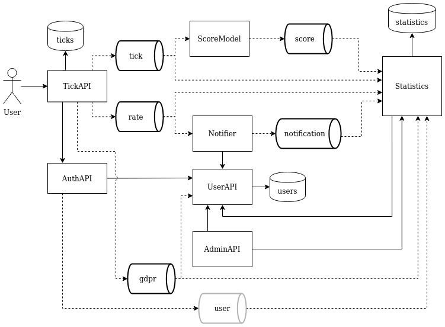

# Event sourcing

The theme of the project is bird watching where the user can report seen birds and rate others bird images. Link to vocabulary in resources at the bottom.

This is an example project for event sourcing in a micro service architecture with concepts around sensitive data in respect to GDPR as well as long term storage for analysis purposes.

## Architecture

The architecture in the image below shows micro services that has differing interaction with the user and user information. Rectangles are micro services, standing cylinders are databases and cylinders lying down are events. Direct connections between services are solid arrows while event production and consumption are dashed arrows.



The core principle of this architecture is that services should not have strong connections to other services and should instead communicate using events. Most services should mimic the `ScoreModel` if possible, or `Notifier` if they require sensitive user data but need to clearly specify usage and retention of said data. Benefits of an event sourcing system will not be described in this repository, please read and watch the resources provided at the bottom. With that said, event sourcing is not the golden solution for everything and we have some exceptions as well such as `TickAPI -> AuthAPI` for authentication, `AdminAPI -> Statistics` for business information and any relation to `UserAPI` which serves as a gateway to sensitive information. These service to service connections can still be event driven but will not be event sourced in the architecture for this project.

## Tick API

This is your regular entry point from the outside to the system. Provides endpoints to tick birds with provided images as well as rate bird images. Interacts with `AuthAPI` to authenticate the user doing the request. Produces events when the user `tick` a bird, `rate` an image or asks for `GDPR` deletion.

## Auth API

Handles authentication and authorization. In our super secure simplified system we just accept and trust anyone that provides a non-empty token. Retrieves the user from the `UserAPI` and produces some `user` info events that statistics is interested in.

## User API

Handles all sensitive information as well as `GDPR` requests. Provides endpoints to connect user id with user information. Retention time for users are until removed.

## Score model

The type of service that has no connections to other services and does not handle sensitive user data, isolated and easy to maintain, update and replace. Consumes `tick` events, scores them according to a secret formula (totally not visible in the source code) and produces `score` events.

## Notifier

Almost the same as `ScoreModel` but also requires sensitive user data. Consumes `rate` events and sends a message to the user who ticked the bird that they have a new rating to check out. Produces `notification` events for statistical purposes. Connects to `UserAPI` to get the email address for the user.

## Statistics API

Consumes all events and produces statistics for analysis purposes.

## Admin API

Convenient tool for getting an overview of the business as well as managing users.

## Events

All events are formatted in JSON and follow a required basic structure defined below. The structure is an inspiration from Cloud Events (linked in resources) and provides a convenient contract between services that produce or consume events. The event delivery guarantees at least once delivery with chance for repetition, so all events consumptions needs to be idempotent. Event id makes an event unique so any following events with the same id can be discarded as duplicates.

An example with updating a major event version is provided with the `rate` event.

```
{
    "id": "<uuid>",
    "type": "...",
    "version": "1.0",
    "data": {},
    "metadata": {
        "source": "...",
        "time": "<RFC3339>"
    }
}
```

| attribute | data type | description | example |
| --------- | --------- | ----------- | ------- |
| id | UUID | Event uuid. | f8a25029-cada-4839-973d-5aef8bf56044 |
| type | string | Type of event. | See events below.
| version | string | Event version with major and minor version. Changes to minor version will not break the consumer contract while major versions will. | 1.0 |
| data | object | All data connected to the event. | See events below. |
| metadata | object | Metadata provides nice to have information, the services are free to add additional fields. | See events below. |
| metadata.source | string | Producer of the event. | "services/TickAPI" |
| metadata.time | RFC3339 | When the event was produced. | "1985-04-12T23:20:50Z" |

### tick

An user has reported a new bird tick. Current version: `1.0`.

<details><summary>Version 1.0</summary>

```
{
    "id": "<uuid>",
    "type": "new",
    "version": "1.0",
    "data": {
        "user": {
            "id": "<uuid>"
        },
        "image": {
            "url": "<uri>"
        }
    },
    "metadata": {
        "source": "services/TickAPI",
        "time": "<RFC3339>"
    }
}
```

</details>

### rate

An user has rated a bird image. Current version: `2.0`.

<details><summary>Version 1.0</summary>

The first version of the `rate` event did not account for the owner of the image.

```
{
    "id": "<uuid>",
    "type": "update",
    "version": "1.0",
    "data": {
        "user": {
            "id": "<uuid>"
        },
        "image_url": "<uri>",
        "rating": <1-5>
    },
    "metadata": {
        "source": "services/TickAPI",
        "time": "<RFC3339>"
    }
}
```

</details>

<details><summary>Version 2.0</summary>

```
{
    "id": "<uuid>",
    "type": "update",
    "version": "2.0",
    "data": {
        "user": {
            "id": "<uuid>"
        },
        "image": {
            "url": "<uri>",
            "owner": "<uuid>"
        },
        "rating": <1-5>
    },
    "metadata": {
        "source": "services/TickAPI",
        "time": "<RFC3339>"
    }
}
```

</details>

### score

An image has been scored. Current version: `1.0`.

<details><summary>Version 1.0</summary>

```
{
    "id": "<uuid>",
    "type": "update",
    "version": "1.0",
    "data": {
        "image": {
            "url": "<uri>"
        },
        "score": <1-5>
    },
    "metadata": {
        "source": "services/ScoreModel",
        "time": "<RFC3339>"
    }
}
```

</details>

### notification

A message has been sent to an user. Current version: `1.0`.

<details><summary>Version 1.0</summary>

```
{
    "id": "<uuid>",
    "type": "email",
    "version": "1.0",
    "data": {
        "user": {
            "id": "<uuid>"
        },
        "message_type": "rate.update",
        "source_event": {
            "name": "rate",
            "id": "<uuid>",
            "type": "update"
        }
    },
    "metadata": {
        "source": "services/Notifier",
        "time": "<RFC3339>"
    }
}
```

</details>

### gdpr

A request for deletion has been received. Current version: `1.0`.

<details><summary>Version 1.0</summary>

```
{
    "id": "<uuid>",
    "type": "delete",
    "version": "1.0",
    "data": {
        "user": {
            "id": "<uuid>"
        }
    },
    "metadata": {
        "source": "services/TickAPI",
        "time": "<RFC3339>"
    }
}
```

</details>

### user

A user has logged in. Current version: `1.0`.

This event can contain sensitive user data so retention time is set to 30 days.

<details><summary>Version 1.0</summary>

```
{
    "id": "<uuid>",
    "type": "login",
    "version": "1.0",
    "data": {
        "user": {
            "id": "<uuid>"
        }
    },
    "metadata": {
        "source": "services/AuthAPI",
        "time": "<RFC3339>"
    }
}
```

</details>

## Resources

- https://en.wikipedia.org/wiki/Twitchers%27_vocabulary
- https://cloudevents.io/
- https://www.youtube.com/watch?v=STKCRSUsyP0
